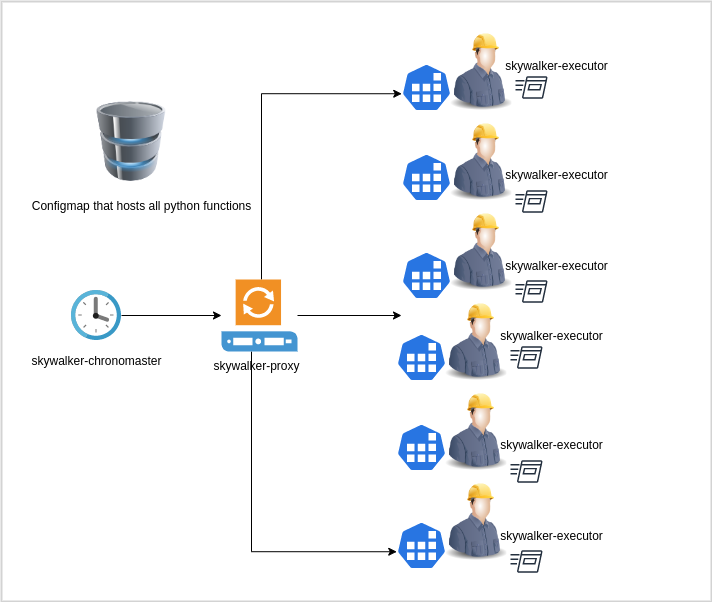

# Skywalker
## Notice
* Inspired by `kubeless`, `openfaas` and `nuclio`, this is yet another python framework to host python functions (Faas) in a microservice environment. Skywalker is making use of `celery` and `flask` framework to achieve the goal.
Up to your imagination and creativity really, you can code a python function and host it on any of your kubernetes environments. 

* Skywalker hosts the function and helps to schedule the execution at your preferences times slots. What makes Skywalker differs from others, it generalised the execution of function. Codes that hosted in the configmap could be scheduled and runs in any executors. 
With this idea in mind, you will not be hassled deploying new kubernetes resources, when a new function is deployed.

* The best use case will be a monitoring system that runs periodically, detecting abnormalies from system and trigger alerts. At any times, when you are running high loads, you can always scaling up the execution by doubling the executors. Hope you like it, and enjoy!

Here is the architecture diagram showing the high level overview of the project. 

## Getting Started
### Prerequisite
* Minikube
* Docker
* Helm
* Redis
### Setup
* Create your minikube cluster. Considering the base requirement of a minikube cluster, you can simply run `minikube start` to create a kubernetes cluster locally.
* You have to install a redis cluster by running command `helm install redis bitnami/redis`. Then monitor the redis pod until pod are fully up and running.
* Before you can go ahead and compile the docker image, please make sure that you are using the registry from minikube. With that you can run `eval $(minikube docker-env)`.
* Once all setup, you can start working on your image. Go to `build/images` directory, and you will find three base images, `skywalker-python`, `skywalker-unzip` and `skywalker-core`.
* At once, please go into each image and run `./build.sh`.
* At last, you will have three different images, namely, `skywalker/python`, `skywalker/unzip`, `skywalker/core`.
* At `build/k8s`, you will find all the kubernetes yaml files for `skywalker-chronomaster`, `skywalker-executor` and `skywalker-proxy`.
* All of your function codes are located at `src/functions`. Thy are are examples that you can refer to e.g `hello-skywalker`.
* Before starting skywalker, you have to load the function codes onto a configmap. By that, you need to go to `tool` directory and run the `./buildcm.sh`. 
* With that, it will find all the python codes with src directory and load them onto a configmap, namely `python-configmap-codes`.
* Once you are done, now you can start skywalker, go to `tool` directory and run `start_skywalker.sh`.
### More details about Skywalker
* From the architecture point of view, `skywalker-chronomaster` acts as the trigger. It reads the `schedule` option derived from each function config.json file, then make a schedule for execution.
* By then, `skywalker-chronomaster` submits async HTTP requests to `skywalker-proxy`. `skywalker-proxy` receives the request and submit `celery` tasks and persists onto backend redis.
* With all the tasks scheduled, `skywalker-executor` picks up the task and execute function as per defines from a config.json.
* Each function comes with a set of config files. e.g. `src/functions/hello-skywalker/hello-skywalker-config.json`, these options is meant for controlling how to execute a function, usually is self-explanatory. 
* There are types of executors to run function, namely `executor.DefaultExecutor`, `executor.WorkflowExecutor`, `executor.ActivePassiveExecutor`, and `executor.ActivePassiveWorkflowExecutor`.
* `handler` and `args` working in pairs. `handler` is a list of function entry point, whereas `args` is the argument list that passed into a function.
* `schedule` defines that interval of function executor, and it is scheduled in `@every` syntax at certain second `s`, minute `m` and hour `h`
* `enabled` is a toggle to enable and disable a function from being scheduled and executed.
* There is a service that you need to know, e.g. `chronomaster` service at port `5050`. You can port forward the service and tap in a web GUI.
* From here, you can `start`, `stop` and `reload` the `chronomaster` service.
* Function codes is updated by updating its configmap. The codes from `skywalker-executor` and `skywalker-chronomaster` will automatically updated by a sidecar `reloader`. However, there are chances after some schedule updates, you need to `reload` the config from the chronomaster GUI.
## Contributors
This projects exists thanks to all the people who contributed. 
<a href="https://github.com/yenonn/skywalker/contributors">here</a>
